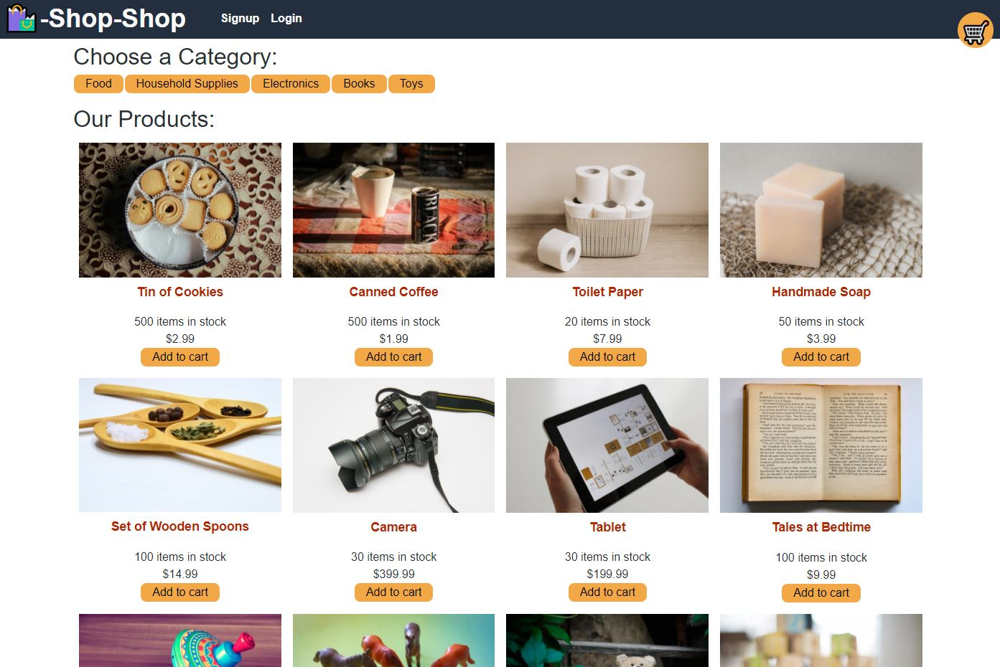

# E-commerce Shop with Redux

## Description

As a user, I create an account through the signup page and after initial signup I can login to the application through a login page. When I view the home page I can see all products available for purchase. If I click on a category the list of products is updated to show only the products under that specific category. 

As a user, I can add items to and remove items from my cart. When I checkout I am brought to a page to enter my payment information. When the payment is completed I am then brought a page that verifies my purchase was completed and then get redirected to the home page.

As a user, when I am logged into the application I have a tab that allows me to see all my purchase history.

As a user, if I leave the application and then return the items I have saved in my cart persist. If I lose connection while utilizing the application any activity will be saved and update the database when reconnected to internet.

## Technology Used

* MongoDB
* Express
* React
* Node
* Mongoose
* IndexDB
* Context API
* GraphQL
* JWT
* PWA
* Stripe

## Installation

* `npm install`
* run `npm start` at the root directory to connect to front and back end servers

## Live Application

Heroku: 